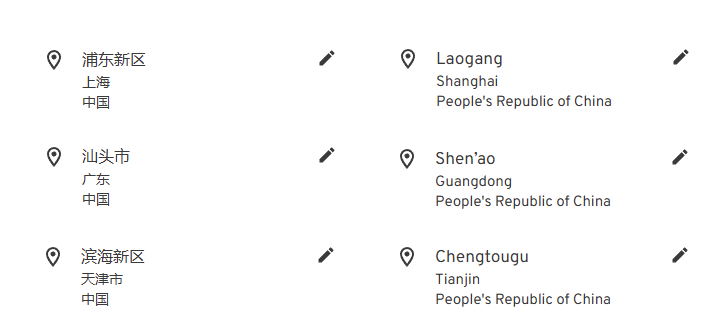

# Immich 反向地理编码汉化

这是一个为 Immich 的反向地理位编码功能提供汉化支持的项目，主要解决 Immich 识别照片拍摄位置都是英文的问题，并对结果进行了优化

- 对国内的地点进行了完整的汉化，国外的地点汉化也进行了实验性支持（目前仅尝试了日本）
- 利用 高德/LocationIQ API 重新将结果标准化为 **国家、省份、城市** 三个等级，避免 Immich 原本数据中不常用的称呼
- 定期拉取最新数据并自动更新发布

以下是使用后的前后对比



# 如何使用

1. 在 [Release](https://github.com/ZingLix/immich-geodata-cn/releases/latest) 中下载 geodata.zip 和 i18n-iso-countries.zip 两个文件并解压

> 分为 [自动更新发布](https://github.com/ZingLix/immich-geodata-cn/releases/tag/auto-release) 和 [手动发布](https://github.com/ZingLix/immich-geodata-cn/releases)  
>
> 前者数据一般较新推荐使用，但可能遇到数据源变动等原因导致生成出的数据不可用，此时建议切换至后者并提 issue 告诉我
>
> **BETA** Release 中 geodata_full.zip 是数据量更大的版本，会在边界的情况下表现更好，但可能会导致识别位置时较慢以及含有过时数据，建议在遇到边界场景识别错误时使用
> 
> **BETA** 提供了精细到三级、四级行政区的文件，详细信息请查看 release 页面

2. 调整你的 docker-compose.yaml，volumes 中增加如下两行（或者根据不同部署方式任意方式替换掉这两个文件夹）

```
volumes:
  - ./geodata:/build/geodata
  - ./i18n-iso-countries/langs:/usr/src/app/node_modules/i18n-iso-countries/langs
```

3. 运行 `docker compose down && docker compose up` 重启 Immich
  - 可以检查一下日志，启动时候会出现 `10000 geodata records imported` 类似的日志，这表明 geodata 更新了
  - 如果没有更新，可以尝试修改 geodata/geodata-date.txt，修改成一个更新的时间，如果旧于 Immich 曾经加载过的时间 Immich 就不会更新
    
4. 启动完成后登录你的 Immich 管理后台，在 `系统管理-任务` 中 `提取元数据` 点击 `全部`，以触发所有照片的元数据刷新，等待任务完成后，所有照片的位置信息就都会显示成中文，后续新增的图片则无需任何额外操作，并且可以用中文进行搜索了

# 如何更新

重新下载最新的 Release 中的文件，替换掉原有的文件，然后重启 Immich 即可。

为了方便快速更新，可以通过如下脚本自动更新

```bash
# cd geodata  在 geodata 目录下进行操作

# 下载脚本
curl -o update.sh https://raw.githubusercontent.com/ZingLix/immich-geodata-cn/refs/heads/main/geodata/update.sh

# 运行，
bash update.sh geodata_admin_2
```

运行完成后需要重启 Immich 重新加载数据。如果希望自动重启，可以在脚本最后增加类似 `docker restart immich_server` 的命令进行重启，或者通过类似如下定时任务的方式一起运行重启。

```bash
5 5 * * 6 bash /immich_data/geodata/update.sh && docker restart immich_server
```

# 如何生成数据

关于如何运作的，或者是想要自定义数据的，可以到 [此处](https://github.com/ZingLix/immich-geodata-cn/tree/main/geodata) 查看。

# License

GPL
