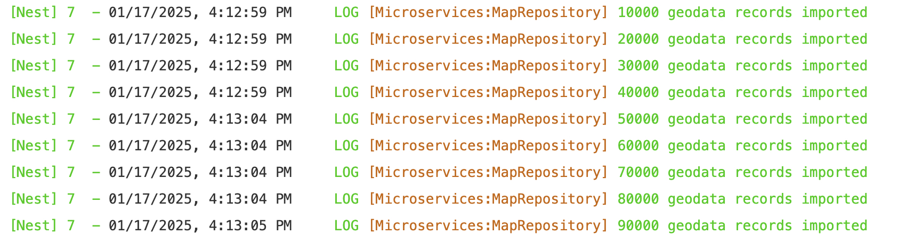

# Immich反向地理位置编码汉化

这是一个为 Immich 的反向地理位编码功能提供汉化支持的项目，主要解决以下几个问题

- 对国内的地点进行了完整的汉化，包括国家、省份、城市，可以直接通过中文名在 Immich 中进行过滤
- 对国外的地点汉化也进行了实验性支持，目前仅在日本尝试
- Immich 默认采用的 Geonames 划分粒度太细，且很多名称并不常用（比如浦东新区的老港），因此通过地图反向地理位置编码（国内高德/国外 LocationIQ）对 Geonames 的数据进行了标准化，
  - 国内全部统一划分为 **国家、省份、城市** 三级（直辖市的城市级别调整为区）
- 定期自动更新发布

# 如何使用

1. 在 [Release](https://github.com/ZingLix/immich-geodata-cn/releases/tag/release) 中下载 geodata.zip 和 i18n-iso-countries.zip 两个文件并解压
2. 调整你的 docker-compose.yaml，volumes 中增加如下两行（或者根据不同部署方式任意方式替换掉这两个文件夹）

```
volumes:
  - ./geodata:/build/geodata
  - ./i18n-iso-countries/langs:/usr/src/app/node_modules/i18n-iso-countries/langs
```

3. 运行 `docker compose restart` 重启 Immich
  - 可以检查一下日志，启动时候会出现 `10000 geodata records imported` 类似的日志，这表明 geodata 更新了
  - 如果没有更新，可以尝试修改 geodata/geodata-date.txt，修改成一个更新的时间，如果旧于 Immich 曾经加载过的时间 Immich 就不会更新
    
4. 启动完成后登录你的 Immich，在 `系统管理-任务` 中 `提取元数据` 点击 `全部`，以触发元数据刷新，等待任务完成后，所有照片的位置信息就都会变成中文了，后续新增的图片则无需任何额外操作

# License

GPL